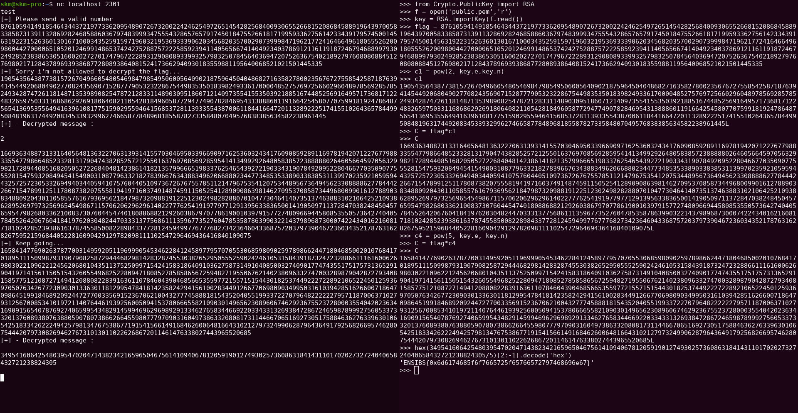

On a p = c^d [n] avec c = M^e [n]

c_4 = 5^e [n]

On calcule C = cc_4 = (M^e)(5^e) = (5M)^e

Si on envoie C l'oracle nous retourne p = ((5M)^e)^d [n] = 5M

Le Flag est donc M/5

H2G2{20eaa863cf1c658485713636e608151c}
